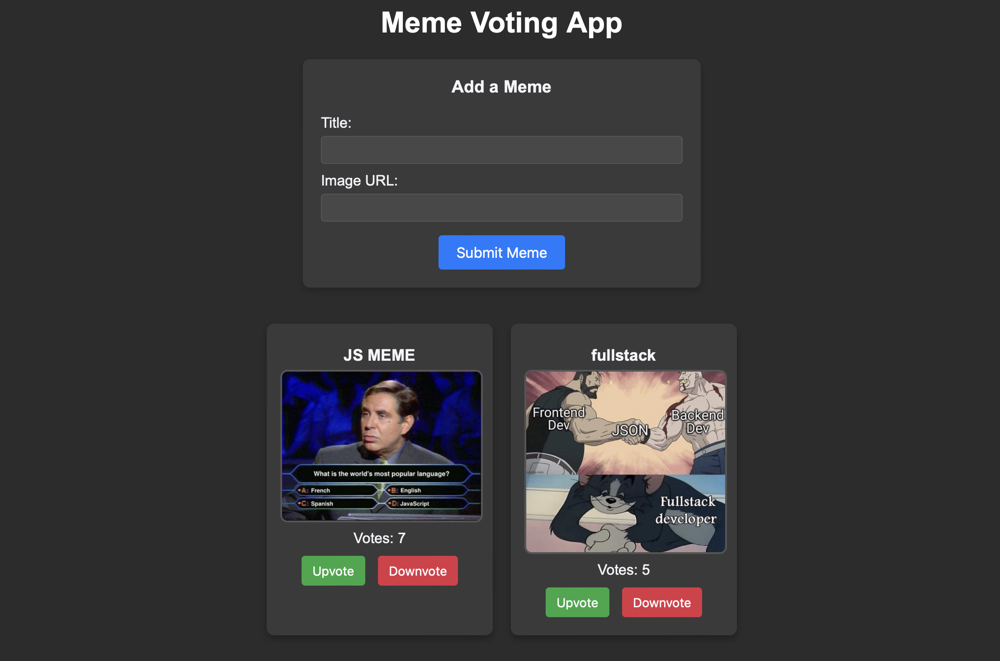

# Meme Voting App

A simple Meme Voting App where users can add memes, view a gallery, and upvote or downvote their favorite memes. This app is built with Node.js, Express, and MongoDB on the backend and HTML, CSS, and JavaScript on the frontend.

## Demo


## Features
- **Add Memes**: Submit memes with a title and image URL.
- **Vote**: Upvote or downvote memes.
- **Responsive Design**: Responsive layout.

---

## Prerequisites

Make sure you have the following installed:
- **Node.js**: [Download Node.js](https://nodejs.org/)
- **MongoDB**: [Install MongoDB](https://www.mongodb.com/docs/manual/installation/)

## Installation and Setup

### Step 1: Clone the Repository

Clone the repository and navigate to the project directory.

```bash
git clone https://github.com/hackenshaw/meme-voting-app.git
cd meme-voting-app
```

### Step 2: Install Backend Dependencies

```bash
npm install
```

### Step 3: Set Up MongoDB

1. **Start MongoDB**: Ensure your MongoDB server is running. You can start it with the command `mongod`.
2. **Database**: The app connects to a local MongoDB instance and will automatically create a database named `memeDB` if it doesn’t already exist.

### Step 4: Start the Backend Server

Run the backend server from the `server` directory:

```bash
cd server
node index.js
```

- The server will be available at `http://localhost:3000`.

### Step 5: Open the App

Open the `client/index.html` file in your browser. Alternatively, you can use a live server extension in your code editor to serve the file.

---

## Project Structure

```
meme-voting-app/
├── server/
│   ├── index.js            # Main server file
│   ├── models/
│   │   └── Meme.js         # Mongoose model for memes
│   └── routes/
│       └── memeRoutes.js   # Routes for meme-related operations
├── client/
│   ├── index.html          # Main HTML file for the frontend
│   ├── styles.css          # Styles for the frontend
│   └── script.js           # JavaScript for frontend interactivity
└── README.md
```

---

## Usage

1. **Add a Meme**: Fill out the "Title" and "Image URL" fields in the form on the frontend and click "Submit Meme" to add it to the gallery.
2. **Vote on Memes**: Use the "Upvote" and "Downvote" buttons on each meme card to adjust the vote count.

---

## API Endpoints

The backend provides the following endpoints for managing memes:

- **POST /memes**: Add a new meme.
- **GET /memes**: Retrieve all memes, sorted by vote count.
- **PUT /memes/:id/vote**: Upvote or downvote a meme by ID (use `?action=upvote` or `?action=downvote`).
- **GET /memes/random**: Retrieve a random meme.

---

## Contributing

Contributions are welcome! Feel free to submit issues or fork the repository and make a pull request with improvements.

## License

This project is open-source and available under the MIT License.
